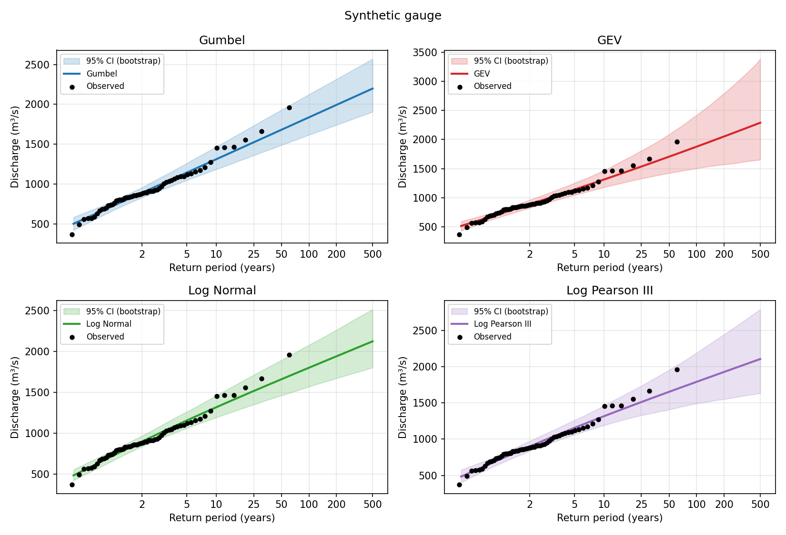

# floodfreq

### 👉 [**Open the web app**](https://biswashk920.github.io/Frequency_Analysis/): paste your data and get results in seconds. No install, nothing uploaded.

Flood frequency analysis for annual maximum discharge (m³/s) or rainfall (mm). Fits **Gumbel, GEV, Log Normal and Log Pearson III**, reports the 2, 5, 10, 25, 50, 100, 200 and 500-year events with bootstrap confidence bands, and produces tables and figures for each distribution.



## Use it

**Web page** (no install): use the [live app](https://biswashk920.github.io/Frequency_Analysis/), or open `docs/index.html` locally. Everything runs in the browser.

**Command line**
```bash
pip install -r requirements.txt
python -m floodfreq.cli examples/synthetic_peaks.csv --type discharge --station "My gauge"
python -m floodfreq.cli --values "520 610 480 905 730 ..." --type rainfall --conf 0.9
```
Outputs go to `results/`: `return_periods.csv`, `fit_statistics.csv`, `fit_<dist>.png`, `fit_all.png`, `compare.png`.

## Method

| Distribution | Fitting | Quantile |
|---|---|---|
| Gumbel | L-moments | x = ξ − α ln(−ln F) |
| GEV | L-moments (Hosking 1990), k clipped to ±0.5 | x = ξ + α/k [1 − (−ln F)^k] |
| Log Normal | mean and sd of ln x | x = exp(μ + σ z) |
| Log Pearson III | mean, sd, skew of log10 x (no regional skew) | log x = μ + K(g, F) σ |

Return period: T = 1 / (1 − F). Confidence bands: parametric bootstrap (default 2000 resamples; the browser page defaults to 1000). Weibull plotting positions by default; Cunnane and Gringorten are available in the CLI. The CLI reports KS, RMSE, AIC and BIC; KS p-values are optimistic because parameters are estimated from the same data.

## Validation

`PYTHONPATH=. python tests/test_floodfreq.py` (or `pytest`) checks parameter recovery on large synthetic samples, cdf/ppf round trips, monotonic quantiles and that confidence bands bracket the estimate. The browser implementation reproduces the Python quantiles on the example data (LP3 can differ slightly on other data: the browser uses the Wilson-Hilferty approximation, Python uses exact Pearson III).

`examples/synthetic_peaks.csv` is **synthetic** (GEV, 60 values), only for demonstration. To validate against a published record, add one to `examples/` and compare with the published return-period values.

## Limits

Short records (n < 30) make the 100–500 year estimates heavy extrapolation. No low-outlier test, regional skew or historical-flood adjustment (Bulletin 17C) yet.

## License

MIT. See [LICENSE](LICENSE).